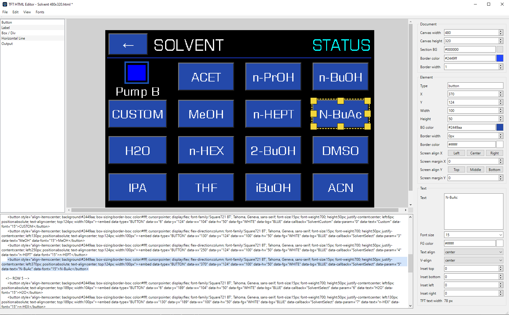
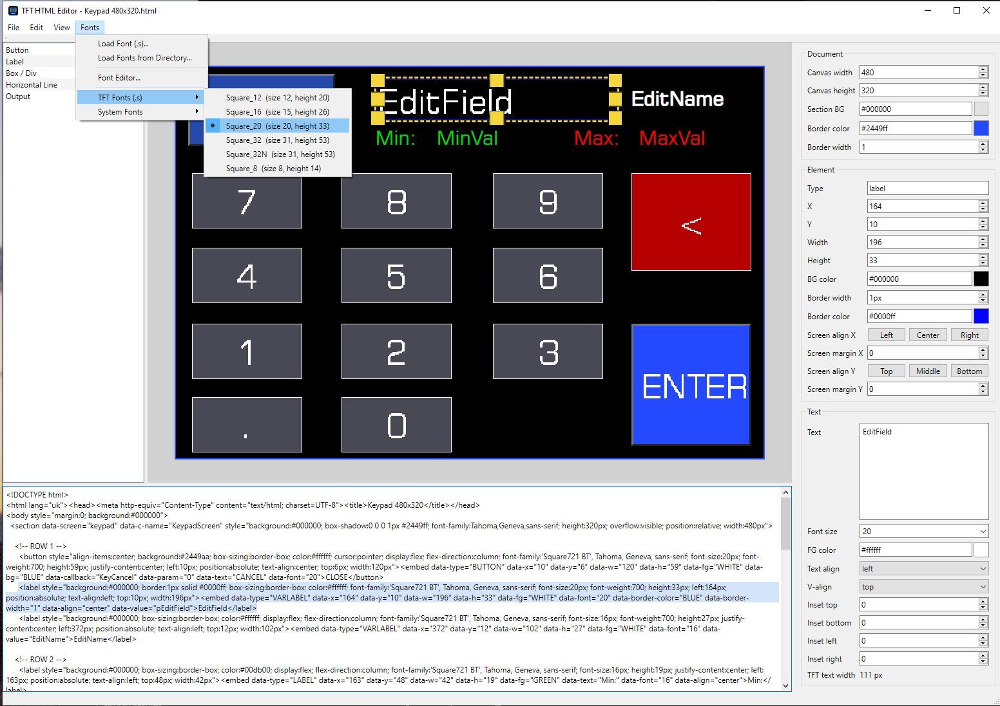
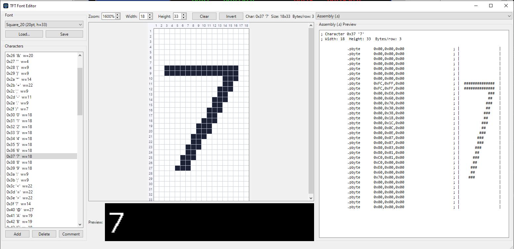
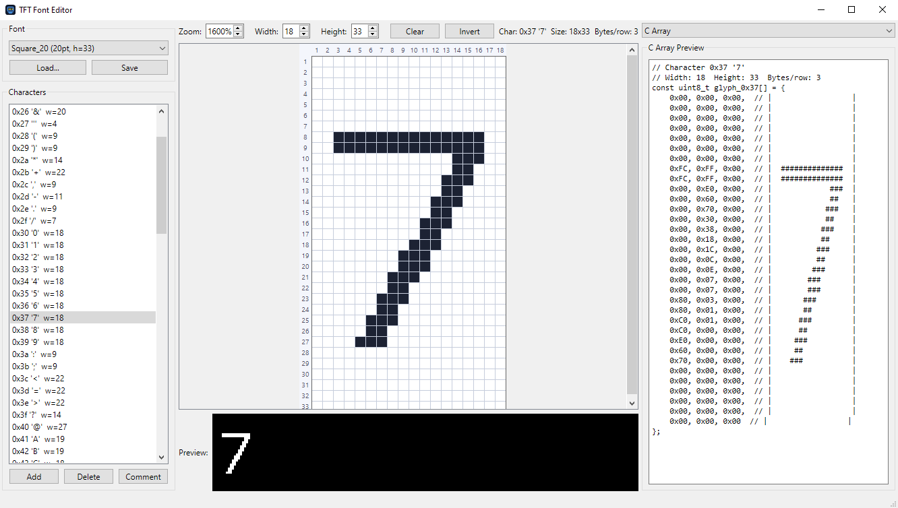

# Drag & Drop HTML Editor

A desktop **WYSIWYG editor for designing screens for embedded TFT touch displays**. You drag UI elements onto a live canvas and the matching HTML is generated and kept in sync in a code view, so the layout you see on screen is exactly what the device renders. A built-in **TFT bitmap font editor** lets you draw glyphs and export them as C arrays or assembly, ready to embed in firmware.

> **Why it exists:** this tool grew out of a commercial project that needed visual touchscreen menus to be designed and edited quickly, on a microcontroller with very little memory. Third-party graphic editors and graphics libraries were ruled out, because the tight memory budget made them unacceptable, so the menus had to be built as compact, hand-authored layouts. This editor was created to design and rapidly iterate on exactly those screens.


---

## Screenshots

**Screen designer** - drag-and-drop canvas, live HTML code view and a property panel:



**Keypad screen and font menu:**



**TFT font editor** - draw a glyph on a zoomable pixel grid and export it as assembly (`.s`):



**...or as a C array (`uint8_t`):**



---

## Features

- **Drag-and-drop canvas** - place buttons, labels, images and lines, then move and resize them with handles on a grid
- **Two-way sync** - the visual canvas and the live HTML code view update each other in real time
- **Property panel** - edit position, size, colors, border, text and font of the selected element, plus document and canvas settings
- **Element management** - select, move, resize, copy / paste, duplicate and delete
- **Grid** - configurable grid with snap-to-grid for precise alignment
- **TFT bitmap font editor** - draw glyphs on a zoomable pixel grid, set per-glyph width and height, with a live preview
- **Font export** - export glyphs as a C array (`uint8_t`) or assembly (`.s`), ready to embed in firmware
- **Font management** - load fonts from a file or a directory, or use system fonts

---

## Tech Stack

| Component | Technology |
|---|---|
| Language | C++17 |
| UI | Qt6 Widgets |
| Canvas | Qt WebEngine (Chromium) with a QWebChannel C++/JS bridge |
| Output | HTML screens and bitmap fonts (C array / assembly) |
| Build | CMake, windeployqt |
| Installer | PowerShell (`build_installer.ps1`) |
| Target OS | Windows |

---

## Building

### Prerequisites

- **Qt 6** with the **Widgets**, **WebEngineWidgets** and **WebChannel** components
- **CMake 3.20+** and an MSVC toolchain (Visual Studio 2022)

### Steps

The simplest path is the helper scripts:

```bash
build_and_run.bat        # configure, build and run
build_installer.ps1      # build a Windows installer
```

Or configure manually with the bundled CMake preset and build:

```bash
cmake --preset Qt
cmake --build build
```

---

## License

The source code of this project is released under the **MIT License** - see [LICENSE](LICENSE).

### Third-party: Qt (LGPLv3)

This application is built with the **Qt 6** framework (Qt Widgets, Qt WebEngine and Qt WebChannel), used here under the **GNU Lesser General Public License v3 (LGPLv3)**. Keeping the application's own code under the permissive MIT license is compatible with the LGPLv3, on the following conditions, which this project meets:

- **Dynamic linking** - the Qt libraries are linked dynamically (shipped as separate DLLs via `windeployqt`), never statically, so a user can replace or relink the Qt libraries.
- **Source availability** - the corresponding source of the Qt libraries is available from <https://www.qt.io/> and <https://code.qt.io/>.
- **Notices** - the LGPLv3 terms and the Qt copyright are acknowledged here; the full LGPLv3 text is at <https://www.gnu.org/licenses/lgpl-3.0.html>.

If Qt were linked **statically**, the combined work would have to be distributed under the LGPL/GPL, so this project deliberately uses dynamic linking.
